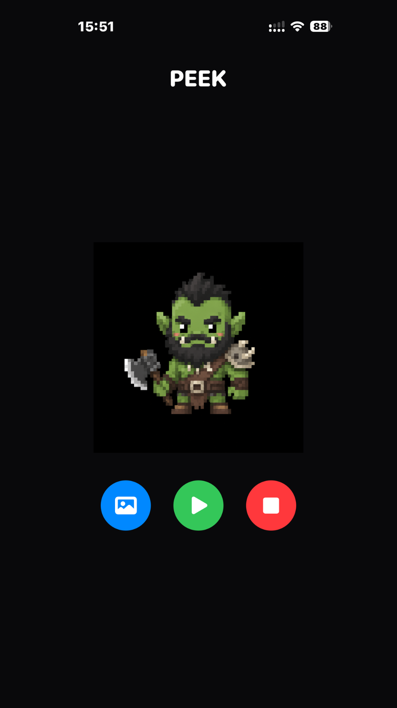
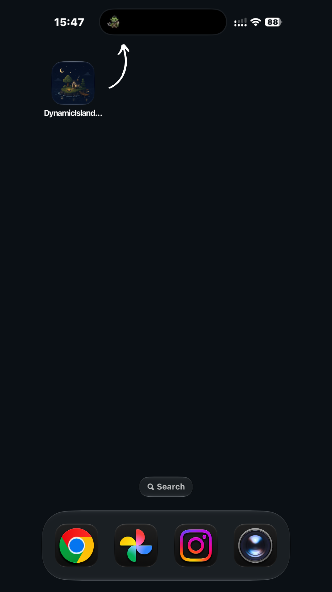
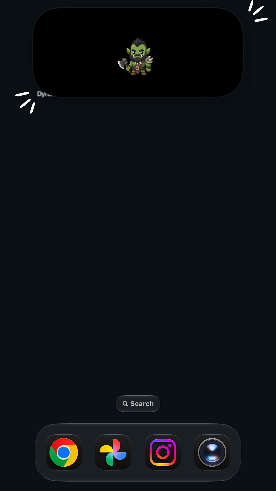
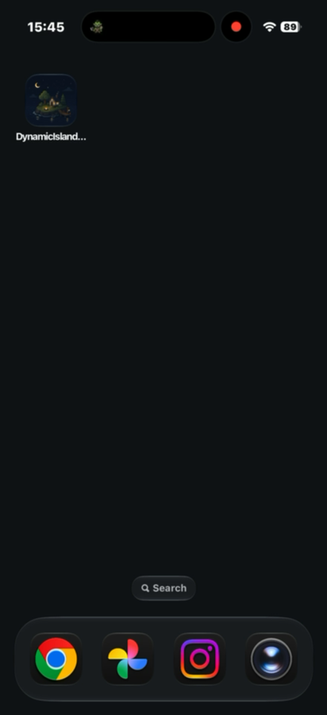

# Dynamic Island Peek

This is a lightweight iOS app that lets you display your favorite image in the Dynamic Island using a Live Activity. It's a fun little project that keeps a photo just a tap away.

## Features

* Choose an image from your photo library
* Generate and save a thumbnail in an App Group container
* Start and stop a persistent Live Activity
* Display the selected image in the Dynamic Island

## To Do

* Support multiple favorite images and switch between them with left and right swipe gestures.
* Support animated images.

## Future Plans

* Add an in-app crop editor when importing photos, allowing users to preview the visible display area before saving.
* Provide a small collection of built-in templates.
* Add a first-launch onboarding experience for setup and basic usage.

## Requirements

* Xcode 26 or newer
* iOS 17 or newer
* A physical iPhone that supports Dynamic Island

## Setup

This repository uses placeholder identifiers so it can be shared publicly. Before running it on your own device, update these values in Xcode:

1. Select the `DynamicIslandPeek` app target and choose your Apple Development Team.
2. Change the app bundle identifier from `com.example.DynamicIslandPeek` to your own unique identifier.
3. Select the Live Activity extension target and set its bundle identifier too.
4. Update the App Group in both entitlement files and in `Shared/PeekShared.swift`.

The placeholder App Group is:

```text
group.com.example.DynamicIslandPeek
```

Use an App Group that belongs to your own Apple developer account.

## Notes

Dynamic Island content is powered by Live Activities, which require a Widget Extension target.
Using Xcode-beta (27) to open the project.

## Demo

Click any image to open a larger preview.

<table>
  <tr>
    <td align="center" valign="top" width="33%">
      <a href="assets/demo/app-ui.png">
        
      </a>
      <br />
      <sub>Choose an image from your photo library and start a Live Activity with a single tap (green button).</sub>
    </td>
    <td align="center" valign="top" width="33%">
      <a href="assets/demo/dynamic-island-compact.png">
        
      </a>
      <br />
      <sub>The selected image appears in the compact Dynamic Island while the Live Activity is running.</sub>
    </td>
    <td align="center" valign="top" width="33%">
      <a href="assets/demo/dynamic-island-expanded.png">
        
      </a>
      <br />
      <sub>Press and hold the Dynamic Island to view an enlarged version of the selected image.</sub>
    </td>
  </tr>
</table>

### Video

<a href="assets/demo/demo-video.mp4">
  
</a>

[Watch the full demo video](assets/demo/demo-video.mp4)
